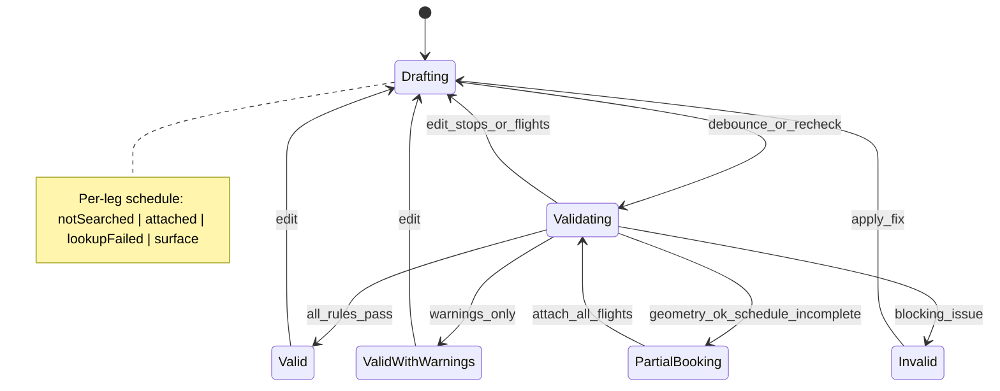

# Builder state machine (v0.2)

- `PartialBooking`: `scheduleSummary.mode === partialSchedule` — amber banner; booking rules not fully active.
- `scheduleComplete`: all flight legs `attached` → §6–§9 and §4(f) hard checks.

UI maps `ValidationResult.outcome` to `TripSummaryStrip` badge colors.
