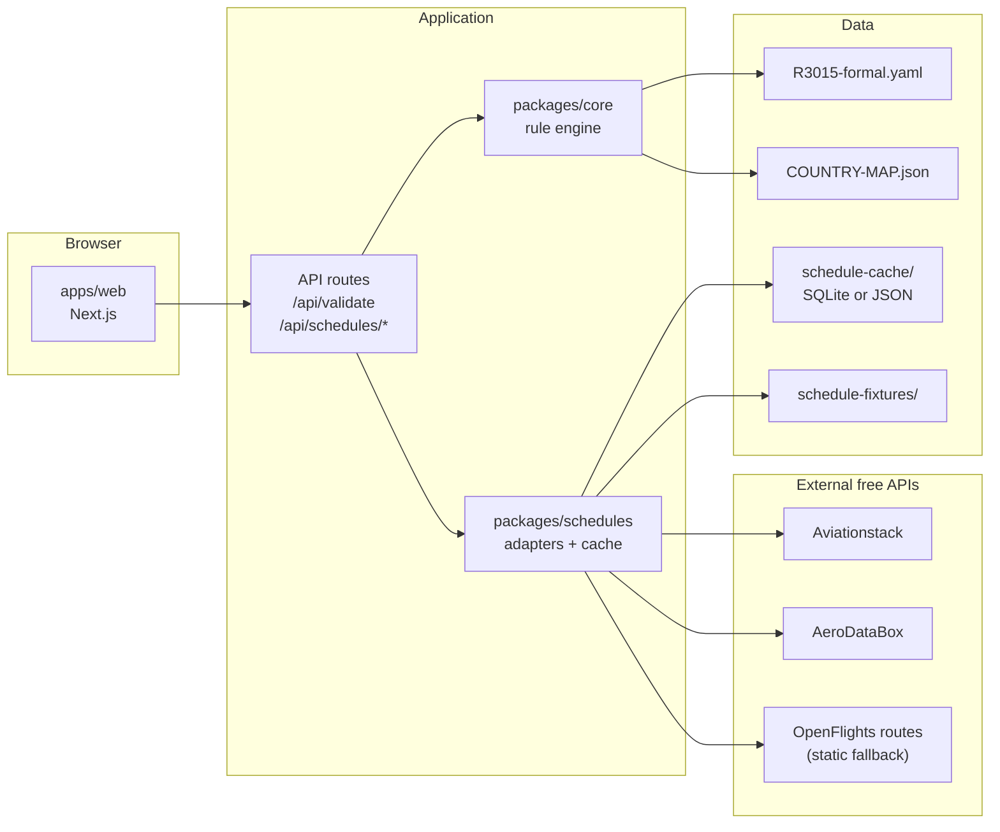

# C4 Level 2 — Containers

## Container responsibilities

| Container | v0.1 | v0.2 |
|-----------|------|------|
| `apps/web` | Route builder, validation panel | + flight picker per segment |
| `packages/core` | Rule 3015 geometry + pricing | + carrier/stopover rules with schedule data |
| `packages/schedules` | Stub interface | Live + cached schedule adapters |

Business logic lives **only** in `packages/core`. Web and schedule packages are thin adapters.
