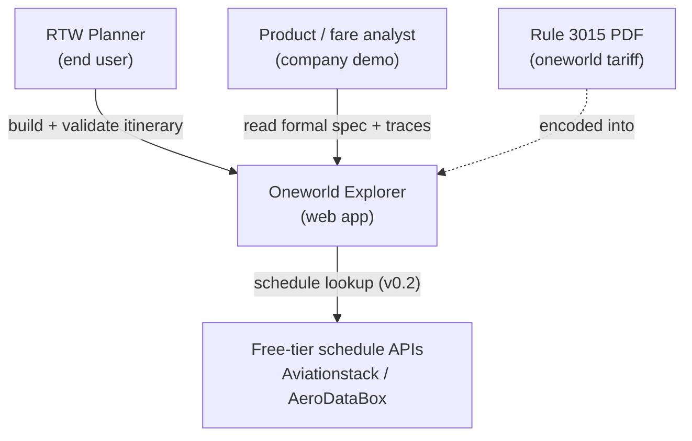

# C4 Level 1 — System Context

## Actors

| Actor | Interaction |
|-------|-------------|
| RTW planner | Builds airport-level itineraries, validates against Rule 3015 |
| Product / fare analyst | Reviews YAML spec, predicate traces, traceability matrix |
| Schedule APIs (v0.2) | Published timetables — not availability |

## External systems

- [Rule 3015 PDF (27 Feb 2026)](https://assets.ctfassets.net/m9ph4qvas97u/58dSxVDQ0kjLFD2Dsxpo6m/0ae0e100a274267777529778cbe91473/oneworld_Explorer_27_FEB_26.pdf) — authoritative tariff source
