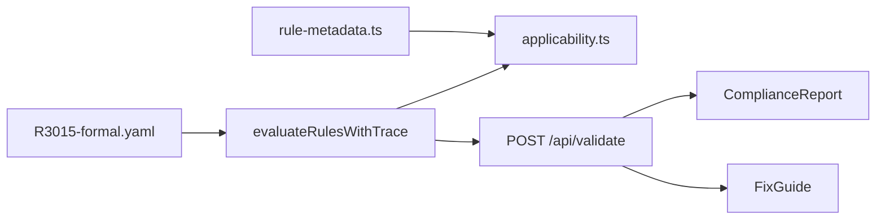

# Explainability data flow (v0.1.3+)

- **Pass (applicable):** `ruleEvaluations` where `passed && applicability === active` → ComplianceReport
- **Fail:** `ruleEvaluations` where `!passed && applicability === active` → ComplianceReport blocking section + FixGuide
- **Not applicable:** `applicability === notApplicable` → collapsed footer
- **Advisories:** `ruleKind === advisory` → Product checks panel
- **Origin/return:** `analysis.originReturn` → Return badge, summary strip, compliance card

See [`open-jaw-vs-surface.md`](open-jaw-vs-surface.md) for §4(c) vs §4(g).
