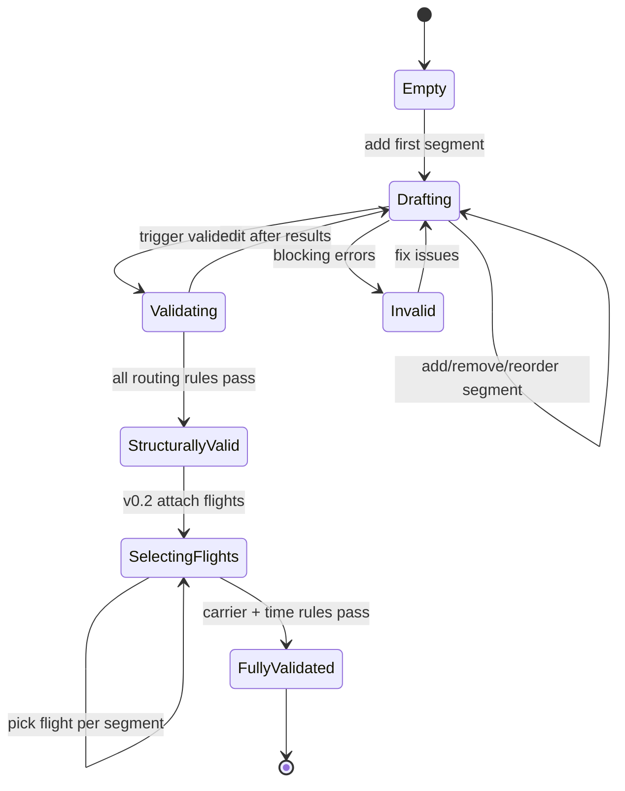

# Itinerary Builder State Machine

## v0.1 states

| State | User sees |
|-------|-----------|
| `Drafting` | Segment editor, IATA inputs |
| `Validating` | Loading spinner |
| `StructurallyValid` | Green valid + trip summary |
| `Invalid` | Rule traces grouped by category |

`SelectingFlights` and `FullyValidated` require v0.2 schedule integration.
