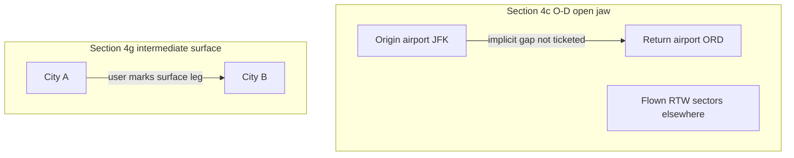

# §4(c) origin–destination open jaw vs §4(g) intermediate surface

Two different PDF concepts share the word “surface” but must not be conflated in code or UI.

## §4(c) — origin must equal return, except permitted O-D pairs

PDF: travel must terminate at the **same point**, except listed origin–destination open jaws (a)–(g).

**Implementation:** [`isOriginDestinationOpenJaw`](../../packages/core/src/rules/helpers/open-jaw.ts) when `origin.iata !== termination.iata`.  
**Classification:** [`detectOpenJawType`](../../packages/core/src/rules/helpers/open-jaw.ts) from endpoint countries/zones.  
**No** explicit `surface: true` leg is required — e.g. JFK → … → ORD all flights is valid US §4(c)(a).

**Guard:** [`hasTicketedOriginReturnConnector`](../../packages/core/src/rules/helpers/open-jaw.ts) rejects a single flown sector `origin → termination` (that would ticket the O-D gap).

## §4(g) — intermediate surface sectors

PDF: passenger may add **intermediate** surface sectors at their expense; transoceanic surface is restricted (SWP origin exception).

**Implementation:** `segment.surface === true` on a leg in the stop list.  
Evaluated by [`R3015-4g-surface`](../../packages/core/src/rules/evaluators/R3015-4g-surface.ts) — independent of §4(c).

## UI

- **Return row badge:** shows detected §4(c) label when `originReturn.mode === openJaw`.
- **Flight / Surface toggle:** §4(g) only; tooltip explains it is not required to finish at a different return airport.

## Analysis API

`analysis.originReturn` on validate response:

| Field | Meaning |
|-------|---------|
| `mode: closedLoop` | Same origin and return IATA |
| `mode: openJaw` | Permitted §4(c) pair; `requiresSurface: false` |
| `mode: openJawPending` | Return ≠ origin but no permitted pair |
