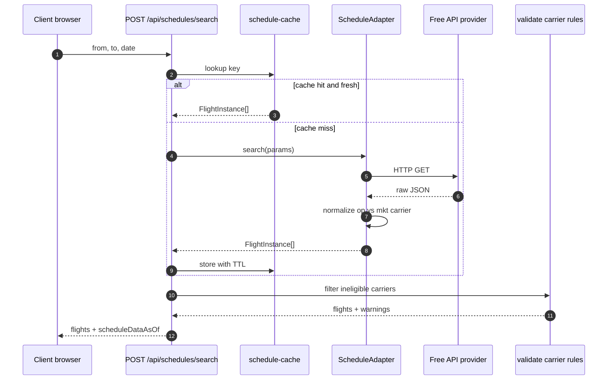

# RPC Sequence — Search Flights for Segment (v0.2)

## v0.1 status

`POST /api/schedules/search` is **not implemented**. `packages/schedules` exports a stub returning `{ scheduleOnly: true, stub: true }`.

See [docs/research/SCHEDULE-DATA.md](../research/SCHEDULE-DATA.md) for provider evaluation.
