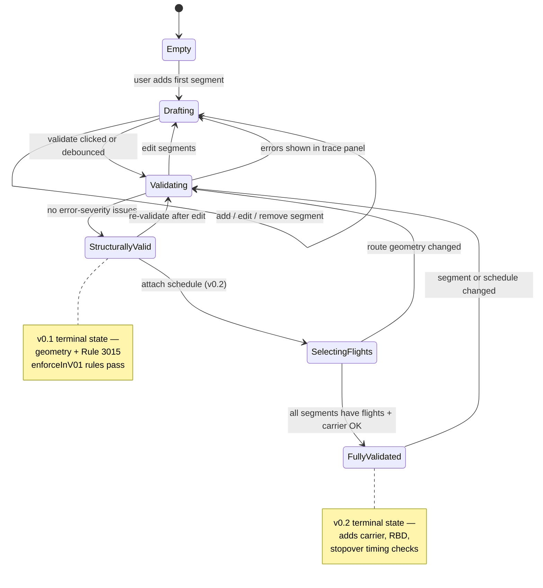

# Itinerary State Machine

## State definitions

| State | v0.1 | Description |
|-------|------|-------------|
| Empty | ✓ | No segments entered |
| Drafting | ✓ | User building airport-level route |
| Validating | ✓ | Core engine running |
| StructurallyValid | ✓ | All v0.1 rules pass (errors cleared) |
| SelectingFlights | v0.2 | User picking real flights per segment |
| FullyValidated | v0.2 | Schedules attached; extended rules enforced |

Warnings (e.g. `R3015-4f-usa-exception` without schedule timestamps) do not block `StructurallyValid`.
