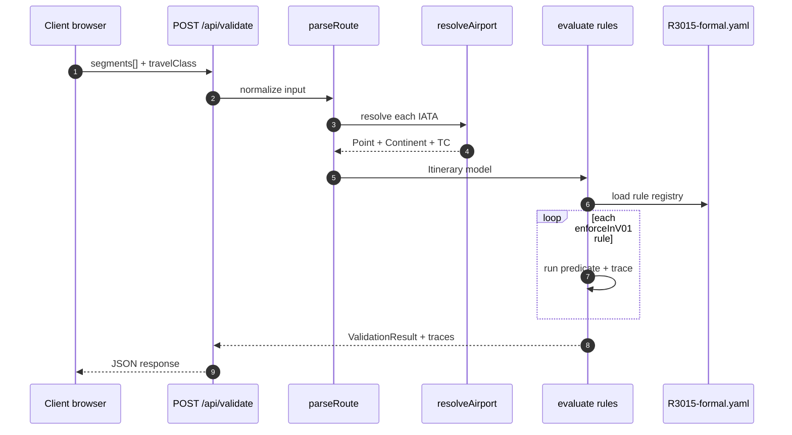

# RPC Sequence — Validate Itinerary (v0.1)

## Response fields

| Field | Source |
|-------|--------|
| `rulesVersion` | `R3015-formal.yaml` (`2026-02-27`) |
| `issues[].code` | YAML rule `id` |
| `issues[].pdfRef` | YAML `pdfRef` |
| `issues[].category` | YAML `category` |
| `analysis` | `analyzeRoute()` — continents, fare basis, direction |

See [docs/API.md](../API.md) for request/response schema.
