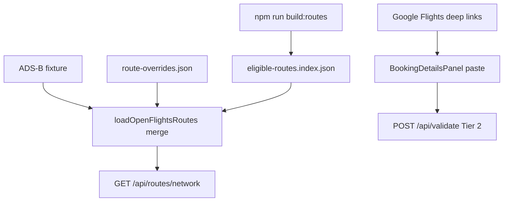

# Route data integration — research decision

**Date:** 2026-06-19  
**Scope:** Validate Method A (Kiwi static routes) and Method B (Google Flights scraping) for OneworldExplorer Tier 1+ network hints and Tier 2 carrier/schedule autofill.

---

**Date:** 2026-06-19 (network sources updated 2026-06-21)

---

## Decision summary (updated)

| Method | Verdict | Action |
|--------|---------|--------|
| **Jonty / FlightsFrom weekly JSON** | **✅ ADOPT** | Replace OpenFlights bootstrap — [ROUTE-NETWORK-SOURCES-SPIKE.md](./ROUTE-NETWORK-SOURCES-SPIKE.md) |
| OpenFlights `routes.dat` (2014) | **Removed** | Superseded by FlightsFrom weekly build |
| Kiwi `/data/routes` | **NO-GO** | Affiliate + 404 |
| Google Flights scrape | **DEFER** | Leg autofill only, not network |

**Recommended path (implemented Jun 2026):** Jonty/FlightsFrom weekly JSON via `npm run refresh:routes`, automated weekly PR in `.github/workflows/refresh-routes-weekly.yml`, manual `route-overrides.json` curation, and optional ADS-B fixture refresh. No runtime schedule API in default UX.

---

## Evidence links

| Artifact | Path |
|----------|------|
| Benchmark corpus (60 routes) | `data/fixtures/route-benchmark-corpus.json` |
| OpenFlights baseline scorecard | `docs/research/route-benchmark-baseline.md` |
| Kiwi spike | `docs/research/KIWI-ROUTES-SPIKE.md` |
| Kiwi vs OF comparison | `docs/research/kiwi-benchmark-comparison.md` |
| GF scrape spike | `docs/research/GOOGLE-FLIGHTS-SCRAPE-SPIKE.md` |
| Kiwi probe fixture | `tests/schedules/fixtures/kiwi-endpoint-probe.json` |
| GF spike fixtures | `tests/schedules/fixtures/google-flights/` |

---

## OpenFlights baseline (Phase 0)

| Metric | Measured | Method A target |
|--------|----------|-----------------|
| Recall (`should-appear`) | **88.9%** | ≥95% |
| False-active (`must-not-appear`) | **0%** | ≤2% (inactive overrides working) |
| Hard failures | 3 missing trunk/newer routes | — |

Gaps: `newer-wy-mct-lhr`, `newer-wy-mct-bkk`, `newer-wy-mct-del` absent from OpenFlights index — WY routes need manual override or fresher source.

---

## Decision matrix

| Need | Method A | Method B | Current |
|------|----------|----------|---------|
| Fresher route pair index | Failed (no API) | Poor (per-query) | Stale but shippable |
| Hub BFS / globe network | N/A | No | Yes |
| Operating carrier §4(j) | Unverified | **Failed spike** | User paste |
| Dated schedule times | No | **Failed spike** | User paste |
| Zero-API default UX | Build-time only (if worked) | No | **Yes** |
| ToS / ops risk | Low (if endpoint existed) | **High** | Low |
| ODbL / OSS redistribution | Unknown (no data) | Problematic | OpenFlights OK |

---

## Architecture (unchanged)



**Not implemented** (research rejected):

- `npm run build:routes:kiwi`
- `scripts/merge-route-sources.ts`
- `source: kiwi-static` merge tier
- `SCHEDULE_LIVE` Google Flights provider

---

## Optional follow-ups (out of scope)

1. **Kiwi Search API** with real `KIWI_TEQUILA_API_KEY` on 10 trunk OD pairs — measure rate limits and virtual-interlining pollution.
2. **gf-search** on Python 3.12 — second opinion if `fast-flights` parser is stale.
3. **WY manual overrides** — add seasonal WY routes to `route-overrides.json` from public timetables.
4. **ADS-B refresh pipeline** — extend `scripts/import-adsb-routes.ts` beyond CI fixture slice.

---

## Research scripts

```bash
# Phase 0 baseline
npx tsx scripts/score-route-benchmark.ts --write-doc

# Phase 1 Kiwi
npx tsx scripts/spike-kiwi-routes.ts --probe-only
npx tsx scripts/spike-kiwi-routes.ts   # needs KIWI_TEQUILA_API_KEY
npx tsx scripts/compare-route-sources.ts --write-doc

# Phase 2 Google Flights
scripts/spike-google-flights/.venv/bin/python scripts/spike-google-flights/spike.py
scripts/spike-google-flights/.venv/bin/python scripts/spike-google-flights/soak.py --rounds 50
```
