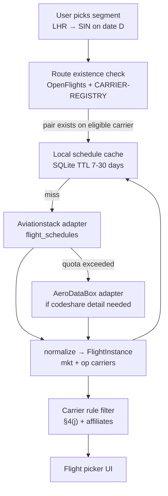

# Schedule data research (v0.2)

## Goal

Integrate eligible oneworld Explorer **published schedules** for segment validation (carriers §4, codeshares §4(j), stopover timing §8, min stay §6). **Not** seat availability or pricing.

## Provider comparison (free / freemium path)

| Provider | Free tier | Schedule data | Op vs mkt carrier | Verdict for v0.2 |
|----------|-----------|---------------|-------------------|------------------|
| [Aviationstack](https://aviationstack.com/) | **100 req/month** free | `/v1/flight_schedules`, `/v1/flightsFuture`, `/v1/routes` | Partial — verify `airline` field mapping | **Primary adapter candidate** |
| [AeroDataBox](https://aerodatabox.com/) via RapidAPI | Free/trial with limited quota | Future schedules by route/date; `CodeshareStatus` | Explicit codeshare fields | **Secondary adapter** — better codeshare metadata |
| [OpenFlights](https://openflights.org/data.html) routes.dat | Free, static | Airline + airport pairs only — no dates/times | Airline code only | **Bootstrap layer** — route existence check |
| [SITA developer.aero](https://www.developer.aero/api-catalog/flight-schedule-overview) | Account required | `marketingCarriers` + `operatingCarrier` | Good field names | Evaluate free dev tier in spike |
| Airline timetable pages | Free | Per-carrier, fragile | Varies | Manual fixture source only |
| [OAG](https://developers.oag.com/) / [Cirium](https://developer.cirium.com/) | Commercial | Gold standard | Yes | **Appendix only** — upgrade path when funded |

## Recommended v0.2 architecture: hybrid free-tier stack

## Free-tier operational constraints

| Constraint | Mitigation |
|------------|------------|
| 100 req/month (Aviationstack) | Cache keyed by `(from,to,date)`; demo fixtures |
| Incomplete op/marketing split | Prefer AeroDataBox; warn "operator unverified" (debate D4) |
| Stale OpenFlights routes | Tag `routeSource: openflights-2026`; quarterly refresh |
| No connection builder API | v0.2: manual flight pick per segment |

## v0.1 status

Geometry-only validation in `@oneworld-explorer/core`. `@oneworld-explorer/schedules` exports stub adapters — see `packages/schedules/src/`.

## Research tasks (Phase 2)

1. Spike Aviationstack `/v1/flight_schedules` — map JSON → `FlightInstance`; test BA178, QF1, AA100, QR739, JL42
2. Spike AeroDataBox — compare `CodeshareStatus` vs Aviationstack for QF/JQ
3. OpenFlights import filtered to eligible + affiliate IATA codes
4. Document quota math per user session with cache hit rates
5. Cache TTL policy (`asOf` + `season` metadata)
6. ToS review for open-source cache redistribution

## References

- [docs/rules/CARRIER-ELIGIBILITY.md](../rules/CARRIER-ELIGIBILITY.md)
- [data/CARRIER-REGISTRY.json](../../data/CARRIER-REGISTRY.json)
- [docs/API.md](../API.md)
